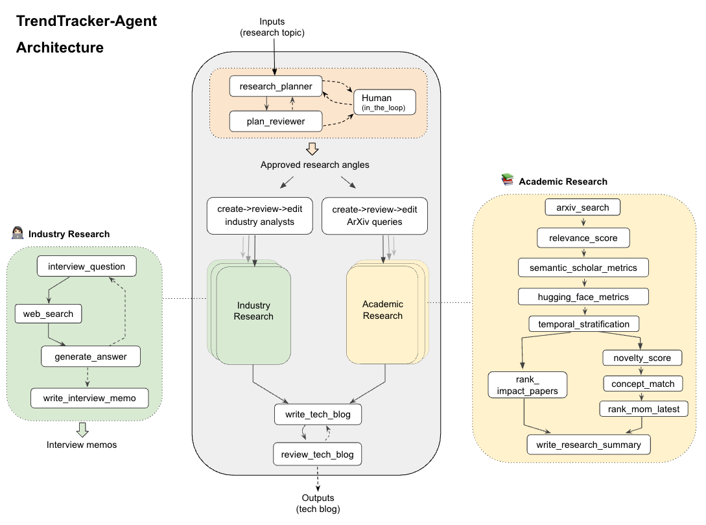

# TrendTracker-Agent using LangGraph 🤖

Struggling to keep up with the rapid developments in AI research and industry? TrendTracker-Agent is designed to provide deep-dive insights into specific AI technologies, giving you a clear picture of how they evolved and where they are headed.

Built out of a personal need to stay updated on complex AI/ML topics, this project offers a reliable foundation for deep research. It bridges the gap between academic research and industry trends using credible, data-driven sources.  

## 📌 📚What does TrendTracker do?

Simply input an AI/ML research topic, and the agent performs deep-dive research to generate a comprehensive technical blog post for you.  

## 📂 Repository Structure

```text
.
├── assets/                  # Architecture diagrams
├── evals/                   # LangSmith evaluation notebooks
│   └── 01_preliminary_model_selection.ipynb
├── samples/                 # Sample tech blogs generated by the agent
├── src/                     # Core logic and source code
│   ├── agent.py             # Main LangGraph construction and node logic
│   ├── prompts.py           # LLM prompts
│   └── utils.py             # Helper functions
├── tests/                   
│   └── test_integration.py  # End-to-end system validation
├── .env.example             # Template for required API keys
├── langgraph.json           # LangGraph deployment configuration
├── pytest.ini               # Pytest configuration settings
├── README.md                # Project documentation
├── requirements.txt         # Project dependencies
└── run_agent.py             # CLI entry point with Human-in-the-Loop feedback
```

## 🏛️ Agent Architecture 

TrendTracker is built using **LangGraph**, transitioning from a linear chain to a stateful, cyclic directed graph. This architecture allows the system to self-correct, parallelize research, and maintain persistent session memory to handle complex research loops and human feedback.  



### 🏗️ The Building Blocks: Core Components

The TrendTracker architecture consists of four core components:

1. **Research Plan:** Generates and reviews a research plan based on your topic. It includes a **human-in-the-loop** step if the topic is too vague or if the reviewer requires manual approval.

2. **Industry Research:** Executes parallel subgraphs that simulate interviews between an industry analyst and a domain expert to explore specific angles of the research topic.

3. **Academic Research:** A parallel subgraph focused on extracting and ranking papers for each academic research angle.

    * **Paper Grouping:** Papers are categorized by age: `impact_papers` (> 90 days), `momentum_papers` (30–90 days), and `latest_papers` (< 30 days).

    * **Evaluation Metrics:** Papers are evaluated across three dimensions:

        (1) **Universal Anchors:** Relevance, author h-index, novelty, and concept match.

        (2) **Academic Validity:** Paper citations and influential citations.

        (3) **Engineering Utility:** GitHub stars, HuggingFace upvotes, and HF model references (tracking how many models on HuggingFace reference the paper).
    
        > <small>💡 **Observation on Ranking Bias:**   
            > During evaluation, I noticed that 50–80% of ArXiv papers are not found on HuggingFace where we extracted **Engineering Utility** metrics. This causes the ranking system to favor papers that have clear "**industry signals**", like GitHub stars or HuggingFace model references. While I discovered this bias during testing, I find it acceptable for this project: it ensures the agent prioritizes research that is being actively adopted by developers and industry, rather than purely theoretical work.</small>  

    </br>

    * **Weighting & Scoring:** Raw metrics are normalized within each group and assigned weights through **Dynamic Scoring Logic**. This accounts for the fact that academic citations take longer to accumulate than immediate signals like GitHub stars.

        * **Latest Papers (< 30 days):** Prioritizes **Universal Anchors** and **Velocity** (how fast it’s gaining traction), as citation data is often unavailable.

        * **Momentum Papers (30–90 days):** Balances early adoption signals with emerging academic validity.

        * **Impact Papers (> 90 days):** Focuses on **Stability**, giving higher weight to long-term academic citations and proven engineering utility.  
        
         > <small>🔍 **Implementation Details:**   
            > For the full scoring and ranking logic, see the `calculate_velocity` and `calculate_final_score` functions in [`./src/utils.py`](./src/utils.py). These calculations are executed within the `rank_impact_papers` and `rank_momentum_latest` nodes in [`./src/agent.py`](./src/agent.py).</small>  
        </br>

4. **Tech Blog Write-Up:** Synthesizes findings from both industry and academic research to draft and review a final technical blog post.

### 🧠 The Brain: Chat Models

A key engineering challenge for TrendTracker was balancing **performance** with **inference latency and cost**. Instead of using a single "frontier" model for all 15 sub-agents, I implemented a tiered architecture based on task complexity and conducted a **preliminary model selection** using **LangSmith** evaluation. The results are as follows:

| Tier | Operational Focus | Example Nodes | Selected Model |
| :---: | :--- | :--- | :--- |
| 1 | Frontier Reasoning |`research_planner`, `write_tech_blog`, `review_tech_blog`|GPT-5.2|
| 2 | Logic & Validation |`plan_reviewer`, `create_arxiv_queries`, `create_analysts`, etc.|GPT-5|
| 3 | Utility & Extraction |`web_search_query`, `generate_answer`, `write_interview_memos`, etc.|GPT-5-mini|

> <small>🔍 **Implementation Details:**   
> For the detailed evaluation logic, LLM-as-Judge prompts, and pairwise experiments results, see the [Preliminary Model Selection: A Tiered Evaluation of Creator Nodes](./evals/01_preliminary_model_selection.ipynb) notebook. </small>  

## ⚙️ Usage
To generate a tech blog, **ensure your environment variables are set** (see [**Setup**](#setup)) and execute the `run_agent.py` script in your terminal.

**Run via Command Line**
```
python run_agent.py
```

**Execution Flow**  
When you run the script, the agent will:
1. Initialize State: The agent will prompt you for the research topic you wish to track.  
    **👀 Action Required**: Input a specific topic. (e.g.,'Track the trend of parameter-efficient fine-tuning (PEFT) for LLMs in the last 12 months.')
2. Generate Research Plan.  
    **👀 Action Required** if the topic is too vague or the reviewer requires approval, you will be prompted for feedback in the terminal (**Human-in-the-Loop**)
3. Parallel Research: The agent concurrently executes the **Industry** and **Academic** research subgraphs.
4. Synthesis & Output: The agent drafts and reviews the final **Tech Blog**, saving the Markdown file directly to the root directory.  

## 🧪 Testing 
The repository includes an end-to-end integration test to verify the LangGraph state transitions and node outputs.

> [!WARNING]
> **Cost & Time Sensitive:** The test performs a live run of the entire TrendTracker agent. It will consume API credits and takes approximately **12-18 minutes** to complete.  

**Run via Command Line**  
To see the real-time progress and logs during the test, run with the `-s` flag:  
```
pytest -s tests/test_integration.py 
```

**What this test validates:**  
* **Graph Compilation:** Ensures the LangGraph architecture is valid.
* **State Persistence:** Verifies that `interview_memos` and `research_summaries` from industry / academic research subgraphs are generated and passed to the parent graph state.
* **Human-in-the-Loop:** Simulates the interruption and resumption logic via the `Command(resume="approve")` pattern.
* **Output Integrity:** Confirms the final `tech_blog` is generated and contains relevant technical keywords.


## 🛠️ Setup 
**Python version:** This project is built using **Python 3.12**.   

1. **Clone the Repository**
```
git clone https://github.com/Doris-QZ/TrendTracker-Agent.git
cd TrendTracker-Agent
```

2. **Create Environment & Install Dependencies**  
Use `python3.12` specifically to create the environment to ensure version compatibility.  
```
python3.12 -m venv .venv
source .venv/bin/activate
pip install -r requirements.txt
```

3. **Environment Variables**  
Copy the template file to create your local `.env` and fill in your API keys:  
```
cp .env.example .env
```

## 🔬 Samples

You can view sample blogs generated during the **End-to-End evaluations** in the [`/samples`](./samples/) folder. Click the blog title to view the tech blog.
1. **Topic:** Track the trend of parameter-efficient fine-tuning (PEFT) for LLMs in the last 12 months.  
    ➾ **Blog:** [PEFT’s Last 12 Months: LoRA/QLoRA Became the Default — Now It’s About Composition, Cost, and Control](./samples/peft-for-llm-12mo-trends.md)  
2. **Topic:** Track the trend of Vision-Language-Action (VLA) models for robotic manipulation in the last 24 months.  
    ➾ **Blog:** [VLA Manipulation Is Shifting From “One Big Policy” to a Deployable Stack](./samples/vla-manipulation-24mo-trend.md)
3. **Topic:** Track the trend of Retrieval-Augmented Generation (RAG) adoption in the healthcare industry over the past year.  
    ➾ **Blog:** [Healthcare RAG Adoption Is Real Now — and It’s Forcing Retrieval to Be Auditable](./samples/rag-in-healthcare-12mo-trend.md)
4. **Topic:** Analyze the evolution of Small Language Models (SLMs) for on-device AI applications in the last 6 months.  
    ➾ **Blog:** [On‑Device SLMs Are Getting Real — and the Hard Part Is Now Everything Around the Model](./samples/on-device-slms-6mo-trend.md)
5. **Topic:** "Agentic RAG" architectures and technology in the last 24 months.  
    ➾ **Blog:** [Agentic RAG Grew Up: From “Fetch Context” to Orchestrated Knowledge Runtimes](./samples/agentic-rag-24mo-trend.md)  

## 🚀 Further Evaluation & Roadmap

While initial LangSmith traces confirm a strong architectural baseline, the following areas are prioritized for future refinement based on end-to-end system performance:

* **Hallucination Benchmarking:** Evaluating the "Writer" nodes to ensure technical accuracy and groundedness in the final tech blog.
* **Citation Integrity:** Verifying that "Writer" nodes generate valid citations pointing to authentic sources.
* **Reviewer Reliability:** Assessing the consistency of "Reviewer" nodes in identifying violations of audit pillars.
* **End-to-End Latency Optimization:** 
    * Current traces show the Academic Research subgraph is highly dependent on data volume, ranging from ~90s for small sets (<100 papers>) to ~400s when processing 2,000 papers through ArXiv, HuggingFace and Semantic Scholar APIs.
    * In contrast, the Industry Research subgraph consistently takes 440–500s due to iterative multi-turn LLMs loops.
    * **Goal:** Since asynchronous handling is already implemented, future work will focus on optimizing these LLM-heavy nodes and managing high-volume API scaling to reduce the total 12–18 minute execution time.
